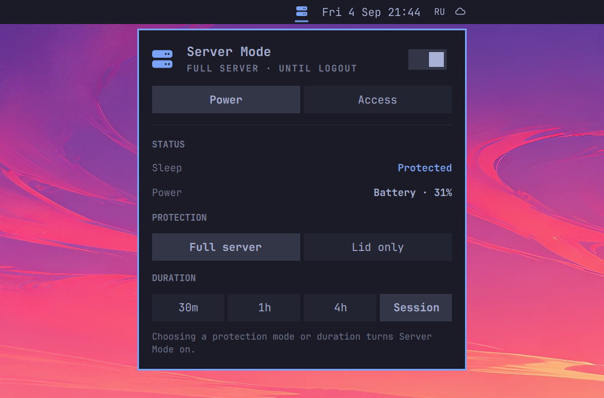

# Server Mode — Remote Access for Omarchy

Turn an Omarchy laptop or desktop into a dependable remote workstation without
leaving sleep prevention, connection addresses, and service status scattered
across terminal commands. Server Mode lives in the Omarchy bar and gives
you one focused control panel for power protection and remote-access readiness.

It can keep the machine awake for an entire login session or a fixed amount of
time, distinguish between full sleep protection and lid-close-only protection,
and stop automatically when battery conditions become unsafe. The Access view
shows the current LAN and Tailscale addresses plus live SSH and remote-desktop
status for Sunshine, RustDesk, and WayVNC.



## Why use it?

Remote access is only useful while the computer remains reachable. A laptop can
quietly suspend when its lid closes, a temporary stay-awake command can be
forgotten, and a cached VPN address can look valid even after the VPN disconnects.
Server Mode brings those signals together and makes the active protection
visible from the bar.

Typical uses include:

- Connecting to an Omarchy machine over SSH from another computer.
- Streaming the desktop through Sunshine and Moonlight.
- Reaching a home workstation through Tailscale or the local network.
- Keeping a laptop awake with its lid closed while preserving manual suspend.
- Running a temporary remote session without leaving a permanent inhibitor behind.

The plugin does not install remote-access software, open ports, change firewall
rules, or enable SSH. It reports the services already configured on the machine
and keeps power behaviour explicit.

## Features

- **Full server mode** blocks regular sleep requests and lid-close suspend.
- **Lid-only mode** blocks lid-close suspend while leaving manual suspend available.
- Session-long protection or quick 30-minute, 1-hour, and 4-hour timers.
- A heartbeat lease that restores normal sleep if the plugin or shell disappears.
- Optional start on login or whenever AC power is connected.
- Optional stop on battery and configurable low-battery cutoff.
- Live LAN address, hostname, and connected Tailscale address.
- SSH installation, service state, port, and a ready-to-copy connection command.
- Live detection for Sunshine, RustDesk, and WayVNC.
- Native, theme-aware Omarchy panel with keyboard shortcuts.
- State-change notifications are available but disabled by default.

## Install

```bash
omarchy plugin add https://github.com/0x1ocean/omarchy-server-mode.git --enable
```

The Server Mode icon appears in the right section of the Omarchy bar.
Plugins execute as the current user and are not sandboxed, so review the source
before enabling this or any third-party Omarchy plugin.

## Use

- **Left click** opens or closes the control panel.
- **Right click** immediately enables or disables the configured default mode.
- `P` opens the Power view while the panel is focused.
- `A` opens the Access view.
- `R` refreshes connection diagnostics.
- `S` copies the generated SSH command.

### Power modes

| Mode | Lid close | Manual or automatic suspend | Best for |
| --- | --- | --- | --- |
| Full server | Blocked | Blocked | An unattended computer that must remain reachable |
| Lid only | Blocked | Allowed | A closed laptop that should still suspend when requested |

Protection does not bypass the lock screen or authentication. When the plugin is
enabled it renews a short runtime lease. If Omarchy Shell exits, the plugin is
disabled, or its files are removed, the inhibitor expires after about one minute
instead of leaving a hidden stay-awake process behind.

### Access status

The Access view reports, but does not configure, the following integrations:

- **LAN:** the first usable global private IPv4 address.
- **Tailscale:** an IP address and MagicDNS name only when the local node is online;
  cached addresses are deliberately ignored after disconnecting. Status input is
  capped before parsing and truncated documents are rejected.
- **SSH:** OpenSSH server installation, `sshd.service` state, configured port, and
  a copyable command using the preferred address.
- **Remote desktop:** installation and live process state for Sunshine, RustDesk,
  and WayVNC.

For access away from home, prefer SSH keys and a trusted private network such as
Tailscale. Sunshine works well with Moonlight for low-latency desktop streaming,
but pairing, codecs, firewall access, and client quality remain Sunshine/Moonlight
settings rather than plugin settings.

## Settings

| Setting | Purpose | Default |
| --- | --- | --- |
| Default protection | Choose Full server or Lid only | Full server |
| Default duration | Keep protection timed or active until logout | Until logout |
| Start on login | Enable protection when Omarchy Shell starts | Off |
| Start when plugged in | Enable when the laptop switches to AC power | Off |
| Stop when unplugged | Restore normal sleep when battery power begins | Off |
| Low-battery cutoff | Stop protection at the selected battery percentage | 15% |
| Notifications | Show state-change notifications | Off |
| Preferred address | Choose Automatic, Tailscale, LAN, or hostname | Automatic |
| Status refresh | Set the diagnostics polling interval | 10 seconds |

## Command line

The included helper is also useful for inspection and troubleshooting from the
installed plugin directory:

```bash
./server-mode on --scope full --duration-minutes 120
./server-mode on --scope lid --duration-minutes 0
./server-mode renew
./server-mode status --json
./server-mode diagnostics --json
./server-mode off
```

The Omarchy service normally supplies the heartbeat. Starting the helper directly
without the loaded plugin is intentionally temporary and expires when no heartbeat
arrives.

## Requirements

Core dependencies are already included with Omarchy:

- Bash
- systemd (`systemctl`, `systemd-run`, and `systemd-inhibit`)
- `jq`
- `iproute2`
- `coreutils`
- `procps-ng`
- `wl-clipboard`

Tailscale, OpenSSH, Sunshine, RustDesk, and WayVNC are optional. Missing
integrations are shown as unavailable and are never installed automatically.

## Validate from source

```bash
omarchy plugin validate .
bash -n server-mode
shellcheck server-mode
qmllint -I "$OMARCHY_PATH/shell" BarWidget.qml Panel.qml Service.qml
node tests/model.test.js
bash tests/helper.test.sh
```

## Update or remove

```bash
omarchy plugin update io.github.0x1ocean.server-mode
omarchy plugin remove io.github.0x1ocean.server-mode
```

Turning the mode off first restores normal sleep immediately. If it is removed
while active, the heartbeat lease stops and normal sleep returns automatically.

## Safety and privacy

A laptop may rely on an open lid for cooling. Check the manufacturer's thermal
guidance before running sustained workloads with the lid closed, and keep the
low-battery cutoff enabled when appropriate.

Server Mode stores no passwords, private keys, tokens, or remote network
data. Diagnostics remain local in Omarchy Shell memory. For the full trust boundary
and lifecycle guarantees, see [SECURITY.md](SECURITY.md).

## License

MIT
